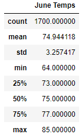
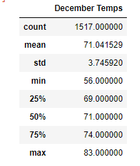

# surfs_up

## Overview
This function of this analysis is the investigation on whether or not erecting a ice cream / surf shop combination store on the island of Oahu is financially responsible with regards to the weather. The ultimate finding is that the opportunity will likley be lucrative.

## Results
### Current Results
- June is typically ~4 degrees hotter than December.
- There are 12% more data points for June than December, but still enough to provide confidence in the data.
- The maximum high temperatures are very similar.

### Data Visualization

## Summary
### Current Results Summary
Considering that the weather does not change too drastically in the cold season, it makes sense to invest in the ice cream surf shop.

### Future Data Analysis
Further queries could be performed to bolster the data:
  1. The year to year temperature data could be queried and compared to show if there is an overall trend in temperatures. If temps are trending up then the icecream shop may become more lucrative looking forward.
  2. The temperature data for a given station could be grouped and queried determine how variable the data is and if there are any outliers for certain stations relative to others. It may signify an improperly calibrated temperature monitoring probe or that the weather is more extreme on one side of the island.
